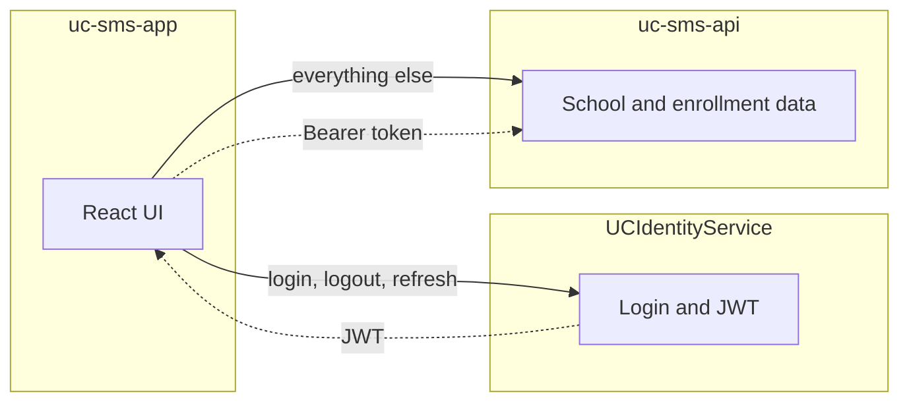

# UC SMS — System Architecture Overview

High-level structure of the three related projects that make up the UC School Management portal.

## The three services

| Service | Repository | Port (local) | Responsibility |
|---------|------------|--------------|----------------|
| **Frontend** | `uc-sms-app` | 5173 | React SPA — screens, navigation, client state |
| **Backend** | `uc-sms-api` | 5286 | Business API — portal profile, school periods, programs, enrollment data |
| **Identity** | `UCIdentityService` | 5135 | Auth — users, passwords, roles, JWT issuance |



**Mental model**

- **Identity** — who you are (credentials, tokens, roles)
- **SMS API** — what you do in the portal (data and workflows)
- **Frontend** — presentation layer that calls both

---

## How they connect (local dev)

The Vite dev server proxies API calls so the browser stays on a single origin:

| Browser path | Proxied to |
|--------------|------------|
| `/api` | `http://localhost:5286` |
| `/identity-api` | `http://localhost:5135/api` |

Environment variables (see `.env.development`):

- `VITE_API_URL=/api`
- `VITE_IDENTITY_API_URL=/identity-api`

Production uses full URLs (see `.env.production`).

### Authentication flow

1. User signs in → frontend calls **Identity** (`POST /auth/login`)
2. Identity returns `accessToken` and `refreshToken`
3. Frontend stores tokens (`src/lib/api.ts`)
4. Frontend loads profile → **SMS API** (`GET /api/auth/me` with Bearer token)
5. SMS API validates the JWT (RSA public key) and returns portal user, student, preferences
6. Subsequent data calls go to the SMS API with the same Bearer token

Identity and the SMS API share JWT issuer, audience, and RSA key configuration. The SMS API validates tokens but does not issue them.

**User linking:** The API resolves `portal_users` by the JWT **email** claim. If no row exists, `PortalUserResolver` auto-provisions one from token claims (role, idNumber, etc.). Identity and SMS API use **separate databases**; they are linked only through JWT claims.

---

## Frontend (`uc-sms-app`)

Feature-oriented React SPA (Vite + TypeScript + Tailwind).

```
src/
├── routes/           # React Router tree
├── pages/            # Route entry points
├── features/         # Domain UI (auth, enrollment, settings, …)
├── components/       # Shared layout and UI primitives
├── hooks/            # Global state (auth, theme, school period)
├── services/         # HTTP wrappers per domain
├── lib/api.ts        # fetch helpers + token storage
└── data/navConfig.ts # Main navigation config
```

**Pattern:** routes → pages → features → services → APIs

| Call type | Service file | Target |
|-----------|--------------|--------|
| Login, logout, refresh | `services/identity.ts` | Identity |
| Profile and business data | `services/auth.ts`, `schoolPeriods.ts`, `programs.ts`, … | SMS API |

Enrollment is organized by audience under `/enrollment/*`: Student, Staff, Parent, Faculty.

---

## Backend (`uc-sms-api`)

Clean Architecture with MediatR (CQRS).

```
src/
├── UCSMS.API/              # Controllers, middleware
├── UCSMS.Application/      # Commands, queries, handlers
├── UCSMS.Domain/           # Entities
└── UCSMS.Infrastructure/   # EF Core, JWT validation, persistence
```

Controllers are thin; they delegate to MediatR handlers.

**Current API areas:** auth (`/api/auth/me`), school periods, programs, users, notifications, students, enrollment, reference data.

**Data domains in one database:**

- **Portal tables** — `portal_users`, `school_periods`, `portal_program_enrollment_settings`, …
- **Legacy SMS schema** — `person`, `program`, `subject`, … (existing UC Online SMS data)

---

## Identity (`UCIdentityService`)

Standalone auth service built on ASP.NET Identity.

```
UCIdentityService.Api/           # HTTP endpoints
UCIdentityService.Application/   # AuthService, DTOs
UCIdentityService.Domain/        # ApplicationUser, roles
UCIdentityService.Infrastructure/ # EF, JWT generator (RSA), refresh tokens
```

**Endpoints:** login, logout, refresh, register, password reset, users, roles, permissions, audit, sessions, JWKS.

---

## Where to add new work

| Change | Project |
|--------|---------|
| New screen or workflow | `uc-sms-app` → `src/features/…` |
| New business endpoint or rule | `uc-sms-api` → Application feature + controller |
| Login, roles, permissions | `UCIdentityService` |
| Portal-only state (theme, selected period) | SMS API `portal_*` tables |

---

## Local dev checklist

Run all three services:

```bash
# Identity
cd UCIdentityService/UCIdentityService.Api && dotnet run   # :5135

# SMS API
cd uc-sms-api/src/UCSMS.API && dotnet run                  # :5286

# Frontend
cd uc-sms-app && npm run dev                               # :5173
```

Restart the SMS API after backend code changes if an old process is still bound to the port.
